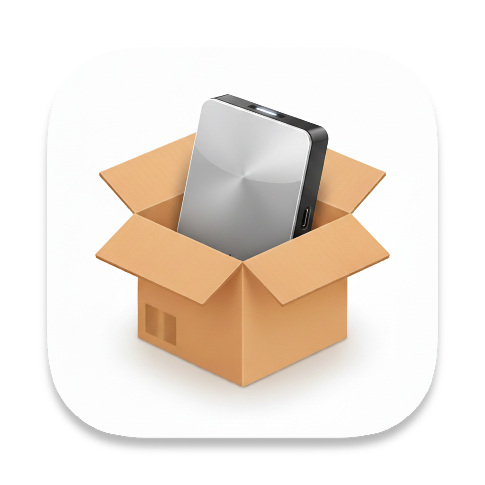

# Outstaller

[中文](./README.md) | English

Outstaller is a simple and efficient application installer for macOS, designed to provide users with a streamlined installation experience that allows apps to be installed anywhere, including external storage devices.

## Features

- One-click install of applications
- Clean and intuitive user interface
- Secure permission management
- Supports replacing and updating existing applications

## Installation

1. Clone this repository:
2. Open `Outstaller.xcodeproj` with Xcode.
3. Build & run the project.

## Usage

- Launch the Outstaller app.
- On first launch, select the destination path for storing `.app` files (this can be changed later via the gear icon in the top right corner).
- Drag and drop `.app` files into the window to copy them to the selected location and automatically create a symbolic link in the system Applications folder.

## Contributing

Contributions are welcome! Please follow these steps:

1. Fork this repository
2. Create a new branch
3. Commit your changes
4. Push to the branch
5. Create a Pull Request

## License

MIT License